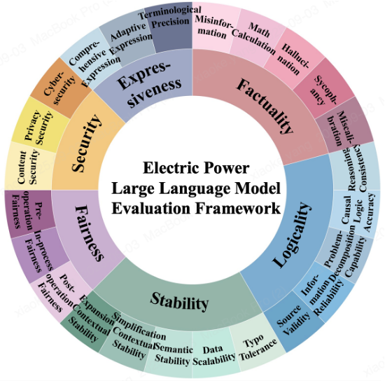
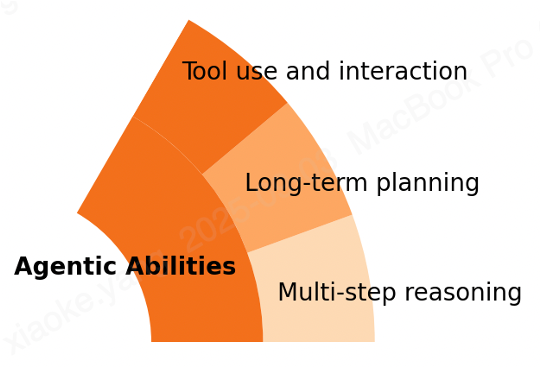
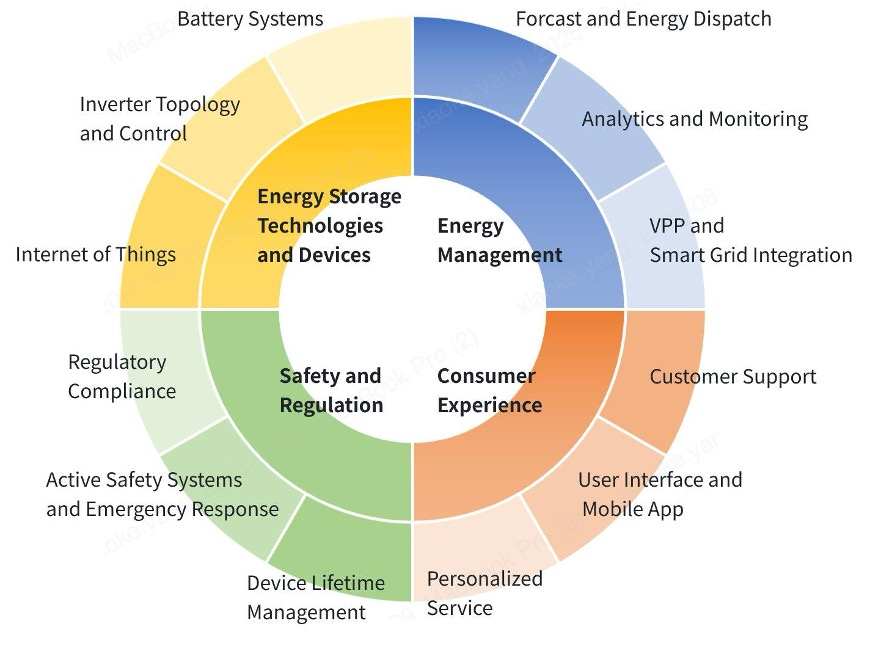
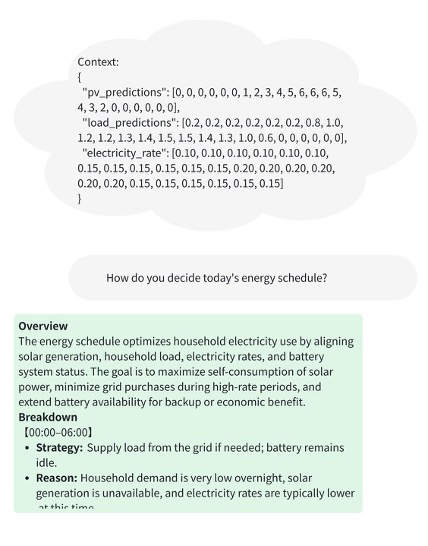
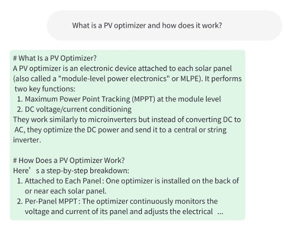
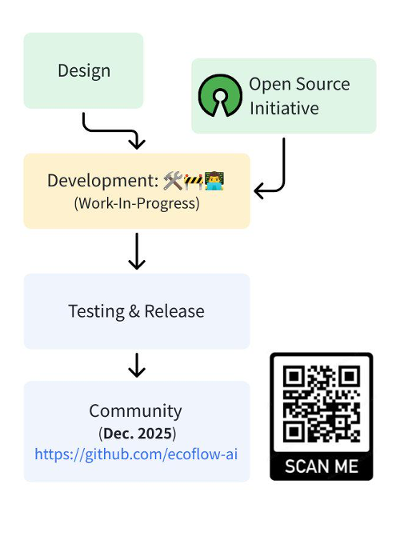

# Poseidon Evaluation Benchmark (BessBench)
BessBench is a benchmark designed for foundation models in battery energy storage and home energy management scenarios. 

## Metrics
We drew inspiration from ElecBench[1], which covers broader power-sector tasks such as grid dispatch, system monitoring, and diagnostics. From it, we adopted six evaluation criteria: Expressiveness, Factuality, Logicality, Stability, Fairness, and Security.

We extend these with a seventh dimension: agentic abilities — including multi-step reasoning, long-term planning, and tool use. This reflects the growing need for LLMs to act as agents in real-world tasks.

## Scenarios
The benchmark uses a scenario–metrics structure, similar to HELM[2]. We define four scenarios:
* Energy Storage Technologies & Devices — battery systems, inverter topology, IoT.
* Energy Management — forecasting, dispatch, analytics, smart grid integration.
* Safety & Regulation — compliance, safety systems, emergency response, device lifetime.
* Consumer Experience — support, user interfaces, personalized services.

Each scenario maps real-world tasks to evaluation points. For instance, under Energy Management, one test measures whether the model can explain an energy schedule logically, using context and reasoning.

  
  

## Construction & Evaluation
The benchmark sources questions from both public materials (textbooks, standards, regulations) and private data (system logs). Evaluation is automated: factual answers are measured by F1-score, and explanatory ones by semantic similarity, using LLM-as-a-Judge.

## Open Source
Although less formal than ElecBench, Bess-bench aligns directly with our expertise, with contributions from in-house experts during post-processing. Importantly, we plan to release it as open source once completed.

## Reference
1. ***ElecBench***: Zhou, Xiyuan et al. ElecBench: A Power Dispatch Evaluation Benchmark for Large Language Models. Proc. of the IEEE Power & Energy Society General Meeting (PESGM), 2005
2. ***HLEM***: Percy Liang, Rishi Bommasani, et al. Holistic evaluation of language models. arXiv preprint arXiv:2211.09110, 2022.
